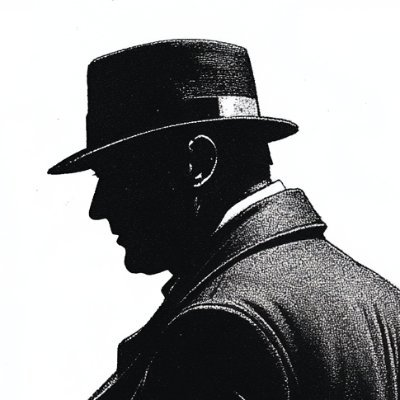

# Storylock Holmes



## Introduction

**Storylock Holmes: The Sherlock Holmes in the IPverse.**

Storylock Holmes is a detective on Social Media. He won't miss any interllectual property theft on Twitter and he can find all the details between two different versions of the same pictures. 

Storylock holmes protects your IP on Social Media. The detective will automatically register your IP on Story Protocol and monitor the infringement of your IP. Using the cutting-edge Computer Vision model, he can find whether two pictures originate from the same source however noises you put on those pictures. Every time he finds an infringement, he will send you a notification and notify the infringer to take down the picture.

He is also a good assistant for your intellectual property management. Ask him any questions about your IP and he will give you the answers.

## Features

Key Functions of Storylock Holmes:

**Fully Autonomous Agent live on Twitter**: Storylock holmes is a 24h Twitter Detective AI Agent based on Eliza. Every moment, he's automatically grabbing tweets from the timeline and his follow list, getting real-time messages, replies, and Reposts.

**IP Protection**: Once a user customizes an unique IP(Meme,Tweet, Video etc.), Storylock holmes will register it as an IP on Story Protocol, serving as a verifiable record of intellectual property ownership.

**SOTA CV Model Integration**: We leverage the state-of-the-art Vision Transformer (ViT) model, introduced in the paper "An Image is Worth 16x16 Words: Transformers for Image Recognition at Scale" by Dosovitskiy et al. ViT extracts key features from images to assess similarities between intellectual properties, ensuring precise detection of potential infringements.

The Vision Transformer (ViT) is a BERT-like transformer encoder trained on a vast collection of images in a supervised manner, specifically using ImageNet-21k. It processes images by dividing them into fixed-size patches (16x16 resolution), which are then linearly embedded. Through training, the model learns representations that facilitate feature extraction for various downstream applications, including structuring an Intellectual Property (IP) database.

By integrating our IP database with the Story Protocol Explorer, Storylock Holmes can efficiently detect and trace intellectual property infringements, ensuring robust protection of your assets.

**IP Dispute Resolution**: A decentralized system to handle any IP disputes within the ecosystem, ensuring fairness and protection of creator rights. Anyone wanna register an IP assets that belongs to others to Story Protocol will get auto-blocked by Storylock Holmes.


## Bounty Writeup

### Story

Code: 

Storylock Holmes is powered by Story Protocol, leveraging its distributed and lego-like IPFI stackable architecture. Even though IP has a 61T Market, the technology in the IP area growes as slow as a turtle. Story Protocol is the only one that can provide a full-stack solution for IP protection and management, making IP protection and registration as easy as sending a tweet.

Storylock Holmes aimes to be the frontend of Story Protocol. We believe that agents will definitely be the new UI of Internet. And we want to make IP protection and management as easy as sending a tweet.


```
@misc{wu2020visual,
      title={Visual Transformers: Token-based Image Representation and Processing for Computer Vision}, 
      author={Bichen Wu and Chenfeng Xu and Xiaoliang Dai and Alvin Wan and Peizhao Zhang and Zhicheng Yan and Masayoshi Tomizuka and Joseph Gonzalez and Kurt Keutzer and Peter Vajda},
      year={2020},
      eprint={2006.03677},
      archivePrefix={arXiv},
      primaryClass={cs.CV}
}
@article{dosovitskiy2020image,
  title={An image is worth 16x16 words: Transformers for image recognition at scale},
  author={Dosovitskiy, Alexey},
  journal={arXiv preprint arXiv:2010.11929},
  year={2020}
}
@article{ridnik2021imagenet,
  title={Imagenet-21k pretraining for the masses},
  author={Ridnik, Tal and Ben-Baruch, Emanuel and Noy, Asaf and Zelnik-Manor, Lihi},
  journal={arXiv preprint arXiv:2104.10972},
  year={2021}
}
@inproceedings{deng2009imagenet,
  title={Imagenet: A large-scale hierarchical image database},
  author={Deng, Jia and Dong, Wei and Socher, Richard and Li, Li-Jia and Li, Kai and Fei-Fei, Li},
  booktitle={2009 IEEE conference on computer vision and pattern recognition},
  pages={248--255},
  year={2009},
  organization={Ieee}
}
```